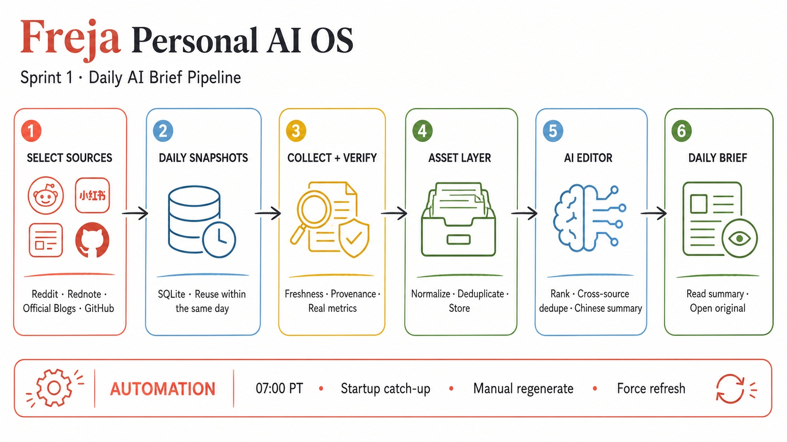

# Sprint 1 Record: Daily AI Brief

**Status:** Feature-complete foundation  
**Recorded:** 2026-07-14  
**Active product loop:** Select sources → Generate brief → Read summary → Open original

## Product Outcome

Sprint 1 establishes one dependable feature rather than exposing the full Personal AI OS roadmap. Freja produces a traceable Chinese AI brief from user-selected sources and preserves the collected evidence as Assets.

The current interface deliberately hides incomplete Idea, Library, Research, Archive, Task, Knowledge Graph, and multi-agent surfaces. Their architecture and existing data remain intact for later sprints.

## Completed Capabilities

### 1. Source selection

- Independent source checkboxes.
- Select all and clear all batch controls.
- Select all includes currently usable connectors only.
- Planned connectors remain hidden from the focused product interface.
- Source selection persists in SQLite.
- Connector availability, authentication readiness, health, and errors remain separate from Asset data.

### 2. Verified source connectors

| Source | Acquisition | Sprint 1 behavior |
|---|---|---|
| Reddit | OpenCLI with authenticated Chrome | Selected subreddits; posts older than 72 hours are excluded |
| 小红书 / Rednote | OpenCLI with authenticated Chrome | Configured AI searches on the international site |
| OpenAI Blog | RSS | Official publication feed |
| Anthropic Blog | RSS | Official publication feed |
| Google DeepMind Blog | RSS | Official publication feed |
| Cursor Changelog | RSS | Official release feed |
| Claude Code | GitHub Releases Atom | Official releases |
| Codex | GitHub Releases Atom | Official releases |
| GitHub Trending | Public HTML | Daily trending repositories |

Twitter / X and LinkedIn remain deferred because no compliant, verified collection path is implemented. Hacker News is outside the current registry.

### 3. Freshness and evidence

- Reddit items require a verifiable creation timestamp within 72 hours.
- Lifetime score and comment totals are never treated as evidence of recent activity.
- An old discussion can return in a later sprint only when comment timestamps or count deltas prove renewed activity.
- LLM input includes the source occurrence timestamp.
- Generated summaries must display available publication dates and cannot infer missing metrics or facts.
- Original URLs and contributing Asset IDs are preserved.

### 4. Daily Source Snapshots

- Successful collection results are cached by source, Sunnyvale local date, and connector configuration hash.
- Re-generating on the same day reuses already collected sources.
- Adding a source on the same day collects only the new source.
- Combined candidates are still deduplicated, reranked, and edited into a new final brief.
- Failed source runs are retryable and are not reused as successful snapshots.
- Force refresh bypasses the daily cache.
- Snapshots persist in SQLite and survive backend restarts.

### 5. Brief pipeline

1. Read enabled source subscriptions.
2. Reuse valid daily snapshots.
3. Collect only missing or force-refreshed sources in parallel.
4. Normalize external items into the shared Asset model.
5. Deduplicate by source and source ID.
6. Index only newly created Assets.
7. Rank verified candidates.
8. Generate a Chinese Markdown brief with OpenAI.
9. Persist a new Brief Asset with item IDs and snapshot usage.
10. Render the full brief and open original links in new tabs.

### 6. Daily automation

- APScheduler targets 07:00 in `America/Los_Angeles`.
- The scheduled job generates only when the local date has no brief.
- A 24-hour misfire window handles ordinary macOS sleep when the backend survives.
- Backend startup performs a catch-up check after the scheduled time.
- Manual generation remains available.
- An in-process generation lock prevents manual and scheduled runs from executing concurrently.
- A project-owned macOS LaunchAgent definition is ready but intentionally not installed automatically.

### 7. Focused user interface

- One centered workflow with no inactive navigation.
- Sources grouped into community, official, and code categories.
- Clear selected-source count and generation state.
- One primary generate/regenerate command.
- Full-width readable Chinese brief with publication metadata.
- Original links use explicit external-link treatment and open in a new tab.
- Desktop and mobile layouts are covered by Playwright.

### 8. Architecture and operations

- FastAPI service and repository layers.
- Next.js and Tailwind frontend.
- SQLite persistence with PostgreSQL-compatible SQLAlchemy models.
- Chroma adapter retained for future retrieval, outside the current UI.
- OpenAI configuration through `.env`.
- Docker and Docker Compose foundation.
- Health endpoint, logging, error isolation, type hints, OpenAPI, unit tests, and browser tests.
- “Everything is an Asset” remains the durable architecture rule.

## Sprint 1 Data Additions

`source_snapshots` records:

- `source_id`
- `local_date`
- `config_hash`
- `status`
- `asset_ids`
- `item_count`
- `error`
- `collected_at`

The identity `(source_id, local_date, config_hash)` is unique.

## Operational Constraints

- Reddit and Rednote require a connected OpenCLI Chrome extension and valid login session.
- The local backend must run for scheduling and catch-up behavior.
- macOS login automation requires explicit LaunchAgent installation after the development server is stopped.
- Current locking is process-local and assumes one backend worker.
- Redis is not required for Sprint 1.

## Deferred Beyond Sprint 1

- Twitter / X and LinkedIn connectors.
- Recent-activity detection for old community threads.
- Per-item LLM summary cache.
- Brief history and Archive UI.
- Idea Inbox and idea retrieval workflow.
- Knowledge Library and semantic search UI.
- Research, Career, Learning, Creative, and Life agents.
- Knowledge graph and relationship discovery.
- Distributed jobs, multi-worker locking, Redis, PostgreSQL, and multi-agent orchestration.

The deferred backlog and re-entry requirements live in [CURRENT_FOCUS.md](CURRENT_FOCUS.md) and [ROADMAP.md](ROADMAP.md).

## Verification Baseline

- Backend unit and integration tests cover source configuration, freshness, Asset behavior, collectors, and same-day snapshot reuse.
- Snapshot tests prove an existing source is collected once and a newly enabled source is collected independently.
- TypeScript strict checks pass.
- Playwright covers the focused desktop workflow, mobile overflow, visible source scope, and original-link behavior.
